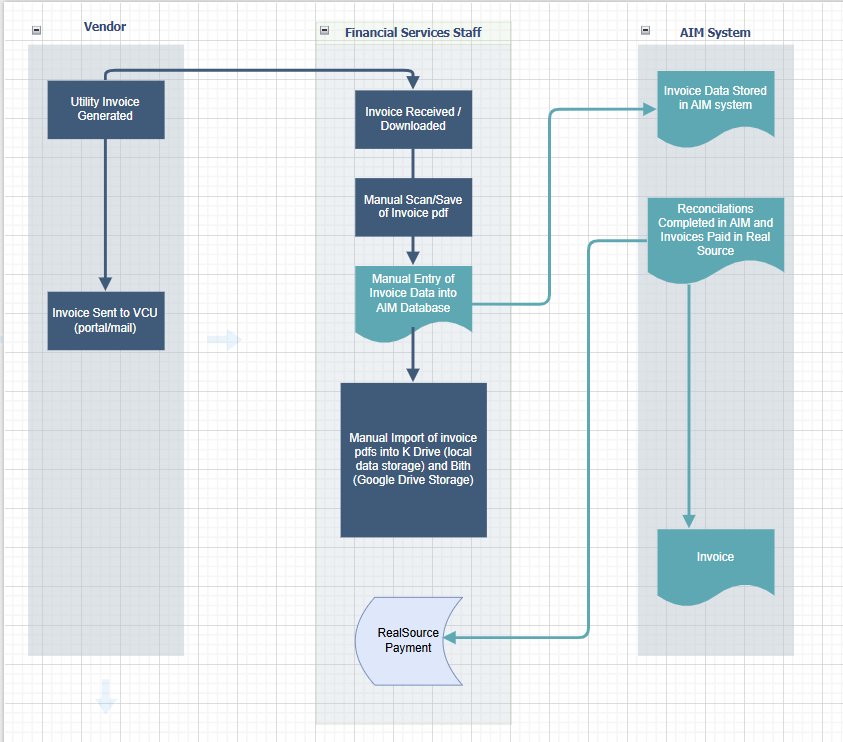

# Episode 1: Understanding Before Building — Mapping the Invoice Workflow

## Screenshot

---

## Summary  

Before building any automation, I mapped out the **current utility invoice workflow** using a swimlane diagram.

The objective was to understand how invoices move across vendors, financial staff, and internal systems before designing an automated solution.

---

## Explanation  

This diagram represents the **current state (existing SOP)** for handling utility invoices.

### Key Flow Breakdown

**Vendor**
- Utility invoice is generated  
- Invoice is sent to VCU (portal or mail)  

**Financial Services Staff**
- Invoice is received or downloaded  
- Invoice is manually scanned/saved as a PDF  
- Data is manually entered into the AIM database  

**AIM System**
- Invoice data is stored  
- Reconciliations are completed  
- Payments are processed in the source system  

---

## Key Observations  

- The process is heavily dependent on **manual data entry**
- Multiple **handoffs between people and systems**
- High potential for:
  - data entry errors  
  - delays in processing  
  - inconsistent formatting  
- No centralized structured pipeline for invoice data  

---

## Key Insight  

This swimlane is not just a diagram — it is the **foundation of the system I am building**.

It connects:
1. **Business Process** → how work is currently done  
2. **Data Flow** → how invoice data moves and transforms  
3. **System Design** → where automation can be introduced  

Understanding this is critical before building any pipeline or automation layer.

---

## Why This Matters  

By clearly mapping the current workflow, I can:
- identify inefficiencies and bottlenecks  
- justify automation to leadership  
- design a system that integrates into real operations  
- transition from manual processing → structured data pipeline  

---

## What This Enables Next  

This sets up the next phase of the project:
- design a **future-state automated workflow**
- introduce **OCR (Gemini) for invoice extraction**
- implement **data validation + structured storage**
- build **SQL + dashboard layer for analytics and reporting**

---

## Reflection  

Nothing was automated today — but this is where everything starts.

Before building systems, you have to understand them.

This is the first step in turning a manual process into a **scalable data asset**.
